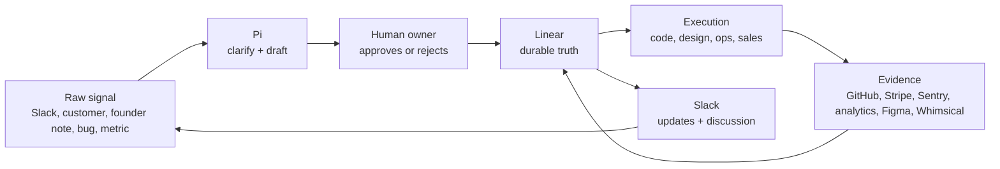
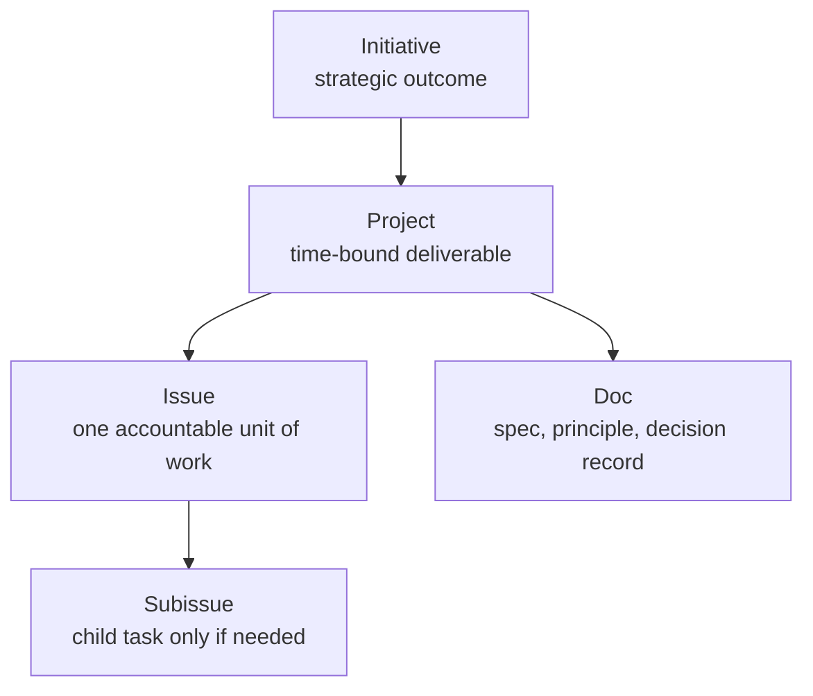
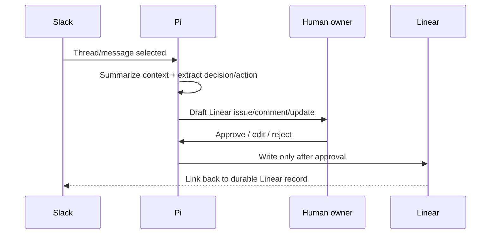
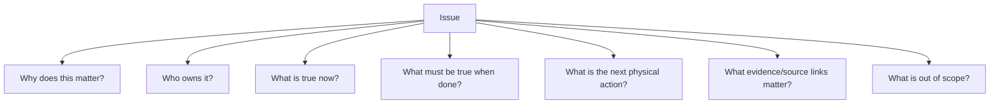
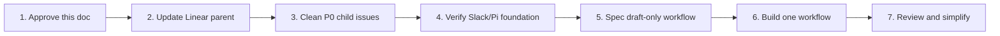

> [!WARNING]
> **Archived / superseded.** This document is historical evidence only. Do **not** use it as current agent instructions or implementation truth. Current truth starts at `README.md`, `docs/SYSTEM_INDEX.md`, `docs/AGENT_CONTEXT.md`, `docs/architecture.md`, and `apps/pi-mom/README.md`.

# Covent OS Source of Truth v0

Status: **Draft for approval**  
Owner/DRI: **Jake Floyd until reassigned**  
Last updated: **2026-05-06**  
Evidence base: `/home/jfloyd/pi-session-audit/2026-05-05/final-context-pack.md`  
Backup of longer draft: `COVENT_OPERATING_SOURCE_OF_TRUTH_V0.md.bak-20260506-141048`

---

## 1. The point

Covent needs a simple operating spine.

The problem is not lack of tools. The problem is that important truth can live in too many places: Slack threads, founder memory, Linear issues, docs, code, analytics, Stripe, Sentry, and agent transcripts.

The operating rule is:

> **Every important signal must become owned, source-linked, actionable Linear truth — or it does not count as company truth.**

Slack creates motion. Pi converts messy context into drafts. Linear stores the durable record. GitHub, Stripe, Sentry, analytics, Figma, and Whimsical provide evidence.

---

## 2. First-principles system map



The loop is good only if it reduces ambiguity and speeds execution. If it creates more process than clarity, it is wrong.

---

## 3. Roles of each system

| System | Job | Not its job |
|---|---|---|
| **Linear** | Source of truth for current work, ownership, specs, decisions, status, acceptance criteria | Casual discussion |
| **Slack** | Fast discussion, intake, notifications, approvals, agent triggers | Permanent memory |
| **Pi** | Summarize, research, draft, audit, transform messy context into structured artifacts | Silent decision-maker |
| **GitHub** | Code, branches, PRs, implementation history | Roadmap |
| **Stripe** | Money truth: customers, subscriptions, revenue, billing events | Product assumptions |
| **Sentry** | Reliability truth: errors, incidents, regressions | Business priority by itself |
| **Analytics** | Behavior truth: usage, funnel, activation, retention | Final interpretation without context |
| **Figma / Whimsical** | Visual explanation and exploration | Operating source of truth |
| **Local/Obsidian docs** | Research, drafts, historical synthesis | Current execution truth unless promoted into Linear |

---

## 4. Current known state

These are facts from the 2026-05-05 Pi audit.

| Area | Current state |
|---|---|
| Linear project | `Distribution` exists under `Frontend Engineering / FE` |
| Distribution URL | `https://linear.app/dispo-genius/project/distribution-9785977025fc` |
| Distribution project ID | `ba9682e2-c14e-4208-98a2-a89f3fb285b8` |
| Current parent issue | `FE-457 — 5-5` |
| Structural issue | `FE-457 / Distribution / Frontend Engineering` does not cleanly describe this work. This is company operating infrastructure, not just frontend distribution. |
| Slack/Pi bridge | Local bridge exists at `/home/jfloyd/.pi/agent/pi-mom/` |
| Slack runner | `/home/jfloyd/sources/run-covent-pi-mom.sh` |
| Slack CLI skill | `/home/jfloyd/.pi/agent/skills/slack-cli/SKILL.md` |
| Linear audit skill | `/home/jfloyd/.pi/agent/skills/linear-subissue-audit/SKILL.md` |
| Known Slack/Pi issue | Slack MCP OAuth worked in a fresh process, but long-running Pi session showed stale `401`; reload/restart and retest. |
| Known Slack CLI trap | Do not run `slack run` from `/home/jfloyd`; run from the real app directory or approved runner. |

---

## 5. The only Linear structure needed right now

Do not over-design the company taxonomy yet.

Use four levels:



Definitions:

| Object | Meaning | Required fields |
|---|---|---|
| **Initiative** | A strategic outcome spanning multiple projects | owner, outcome, why now, success metric |
| **Project** | A bounded deliverable | owner, target state, scope, non-goals |
| **Issue** | The smallest accountable work unit | owner, current state, done state, next action |
| **Subissue** | A necessary child task | parent link, dependency, done state |
| **Doc** | A durable principle/spec/decision | owner, status, source links, decision log |

Proposed parent:

> **Covent OS v0 — Linear × Slack × Pi operating spine**

Current temporary parent:

> **FE-457 — `5-5`**

Decision needed:

> Keep this under FE temporarily, or move/rename into a company-level operating project after approval.

---

## 6. What must be tracked in Linear

### P0 — foundation issues

| Priority | Issue title | Existing mapping | Definition of done |
|---|---|---|---|
| P0 | **Approve Covent OS Source of Truth v0** | `FE-459` or new | This doc or approved derivative is linked in Linear; system roles, issue standard, and first workflow are accepted. |
| P0 | **Clean up FE-457 issue tree** | `FE-457` | Parent has outcome-based title; children have clear titles; `FE-458` is archived or justified; each child has owner/current state/DoD/next action. |
| P0 | **Verify Slack/Pi local foundation** | `FE-460` | Pi reload/restart complete; Slack MCP retested; `pi-mom` start/doctor path documented; correct app directory/runner documented. |
| P0 | **Build draft-only Slack thread → Linear draft workflow** | `FE-463` | One Slack thread/message becomes a proposed Linear issue/comment/update with source link and human approval before write. |

### P1 — useful after P0

| Priority | Issue title | Existing mapping | Definition of done |
|---|---|---|---|
| P1 | **Create issue/spec/decision templates** | child of `FE-459` | Templates exist for issue, spec, decision, weekly update, Slack thread promotion. |
| P1 | **Document Covent Pi skills/agents registry** | child of `FE-463` | One doc lists relevant skills, paths, use cases, boundaries, and limitations. |
| P1 | **Harden `pi-mom`** | child of `FE-460` | Queue/lock, timeout, progress, failure, logging, idempotency behavior are defined or implemented. |
| P1 | **Reconcile Slack manifest with code** | child of `FE-460` | Scopes and slash commands match actual MVP behavior; unused/broad permissions are marked temporary or removed. |
| P1 | **Define Linear ↔ Slack cadence** | new | Rules exist for when Slack discussion becomes Linear truth and how status flows back to Slack. |

### P2 — defer until the loop works

| Priority | Issue title | Existing mapping | Reason to defer |
|---|---|---|---|
| P2 | **Revenue + reliability brief** | new | Valuable, but only after Linear/Slack/Pi loop is trusted. |
| P2 | **Identity spine across app/Stripe/Sentry/analytics** | new | Strategic, but not needed to prove first operating loop. |
| P2 | **Whimsical/visual artifact decision** | `FE-461` | Visuals support truth; they do not define it. |
| P2 | **Browser/Panda automation layer** | `FE-462` | Only useful if a concrete browser workflow exists. |
| P2 | **GitHub PR concierge pilot** | new | Useful after issue packets are consistently high quality. |

---

## 7. First workflow to prove

This is the MVP. Everything else is secondary.



Rules:

1. First version is **draft-only**.
2. No automatic Linear writes until approved.
3. Every draft includes source link, owner suggestion, acceptance criteria, and open questions.
4. If Pi is uncertain, it asks instead of inventing.
5. Success is measured by less ambiguity, not more automation.

---

## 8. Issue standard

Every active Linear issue should answer seven questions.



Template:

```md
## Why this matters

## Owner / DRI

## Current state

## Done state

## Next physical action

## Source links

## Out of scope
```

An issue is not ready if the next physical action is unclear.

---

## 9. Operating rules

1. **Linear is truth. Slack is motion. Pi is leverage.**
2. **One owner per important item.** No owner means no accountability.
3. **No source link, weak truth.** Link back to Slack, GitHub, Stripe, Sentry, analytics, Figma, Whimsical, or prior doc evidence.
4. **Draft before mutate.** Pi should draft first; humans approve material external writes.
5. **Do not automate ambiguity.** Clean the manual loop before scaling automations.
6. **Do not restructure Linear until the new structure is agreed.** Rename/clean the current tree first.
7. **Visuals explain. Linear decides.** Diagrams are supporting artifacts, not the durable record.
8. **Metrics inform. Owners decide.** Stripe/Sentry/analytics provide facts; Linear records the decision/action.

---

## 10. What not to do yet

Do not do these until P0 is complete:

- build many Slack automations;
- broadly restructure Linear;
- make Slack the memory layer;
- add AI app surfaces before the approval loop works;
- create dashboards without knowing which decisions they improve;
- pursue browser automation without a concrete workflow;
- let diagrams become the operating record;
- let Pi silently update external systems.

---

## 11. Success metrics

The system is working when:

| Metric | Direction |
|---|---|
| Time from Slack discussion to Linear artifact | Down |
| Decisions living only in Slack/founder memory | Down |
| Active issues with owner + done state + next action | Up |
| Stale/ambiguous Linear issues | Down |
| Repeated context re-explanation | Down |
| Engineering rework from unclear specs | Down |
| Agent actions with source links and approval gates | Up |

---

## 12. Immediate sequence



Next actions:

1. Review this document and mark anything false or too heavy.
2. Promote this document into Linear as `Approve Covent OS Source of Truth v0`.
3. Rename `FE-457 — 5-5` to the real outcome or create a new parent and link the old tree.
4. Clean child issues: `FE-459`, `FE-460`, `FE-463`, `FE-461`, `FE-462`; archive or justify `FE-458`.
5. Verify Slack/Pi foundation.
6. Write the draft-only Slack → Linear workflow spec.
7. Build only that workflow.

---

## 13. North star

Covent should become a company where important context does not decay.

A signal enters Slack, product usage, customer conversation, Stripe, Sentry, GitHub, or founder thinking. Pi helps clarify it. A human approves it. Linear preserves it. The team executes from it.

That is the operating system.
